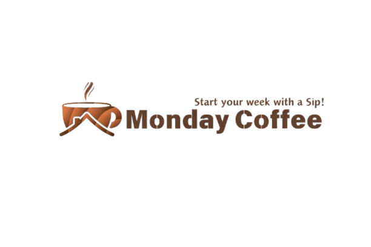
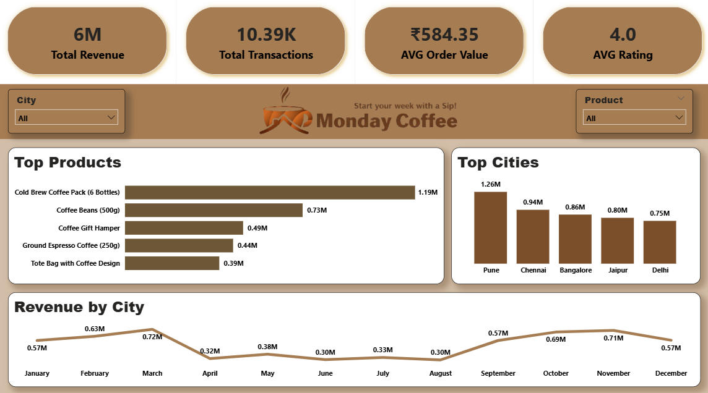
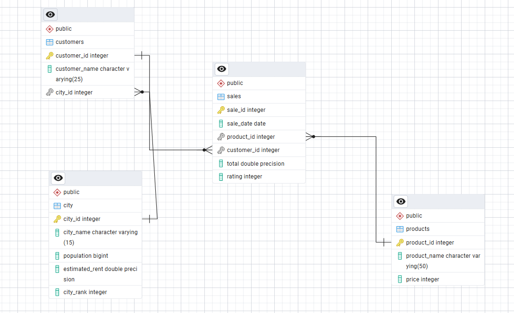

#  MONDAY COFFEE EXPANSION (SQL,Power BI Project)

## Objective
The goal of this project is to analyze Monday Coffee’s sales data since January 2023 to identify trends, understand customer behavior, and evaluate performance. The insights will help improve business strategies and drive growth, while also recommending the top three cities in India for new coffee shop locations based on demand and sales potential. This analysis was conducted using advanced SQL queries and an interactive Power BI dashboard, and the key business insights and recommendations are provided below.

---

---

## Business Insights

- Cold Brew Coffee Pack consistently emerges as the top-performing product across all major cities, making it the ideal flagship offering.

- Sales demand surges during the festive season (September, October, November). Prioritize inventory, marketing campaigns, and Diwali promotions to maximize revenue.

- Historical trends confirm September–November as the peak season, delivering the highest growth rates and revenue nationwide.

- Pune, Jaipur, and Chennai are the most profitable markets, showing high customer spending relative to operational costs—ideal for expansion.

- Customer behavior varies by city:  
  - Pune → strong preference for premium products (₹1,000+)  
  - Jaipur → volume-driven and price-sensitive  
  - Kanpur → emerging opportunity with low rent and solid revenue potential  

- Premium products (₹1,000+) generate ~4x higher revenue, with consistent customer ratings across price tiers.

---

## Recommendations

1. **Pune**
   - Very low average rent per customer 
   - Highest total revenue 
   - High average sales per customer 

2. **Delhi**
   - ~7.7 million estimated coffee consumers
   - Average rent per customer ₹330 (under ₹500)

3. **Jaipur**
   - Highest number of customers
   - Lowest average rent per customer (₹156)

---

## ER Diagram

---

## Key Questions

- Coffee Consumers Count  
- Total Revenue from Coffee Sales 
- Sales Count for Each Product  
- Average Sales Amount per City   
- City Population and Coffee Consumers  
- Top Selling Products by City  
- AVG Rating of Products in Each City  
- Revenue Efficiency by Price Tier 
- Customer Segmentation by City  
- Average Sale vs Rent 
- Monthly Sales Growth 
- Market Potential Analysis  
